# Intro
## 关于线程和多线程编程的主要目标：

1. 介绍线程的概念，它是计算机多线程系统中CPU利用的基本单位。
2. 讨论Pthreads线程库的应用程序接口（APIs）。
3. 探索提供隐式线程的几种策略。
4. 检查与多线程编程相关的问题。
5. 介绍Windows和Linux操作系统对线程的支持

## Motivation
为什么需要多线程(multithreaded)编程? 多线程应用在哪些场景里?
1. 大多数现代应用程序都是多线程
2. 线程在应用程序内部运行
3. 在应用程序中的多个任务可以由单独的线程来实现, 例如
    - Update display 更新显示
    - Fetch data 获取数据
    - Spell checking 拼写检查
    - Answer a network request 响应网络请求
4. 进程的创建是一个重量级操作, 线程创建是轻量级的
5. 多线程可以简化代码, 提高效率
6. 内核通常是多线程的
## 进程与线程的差异
1. 进程:
    - heavy-weight
    - 是一个完全独立的程序, 拥有自己的变量, 堆栈(stack), 中断例程(Interrupt routines)和文件
2. 线程:
    - 线程共享相同的内存空间
    - 线程之间共享全局变量global variables
    - 同一进程中可以由多个线程, 每个线程都有自己的指令指针(IP)和堆栈(Stack), 但它们共享代码, 堆, 中断例程和文件

进程时完全隔离的,而线程在同一进程内部共享资源
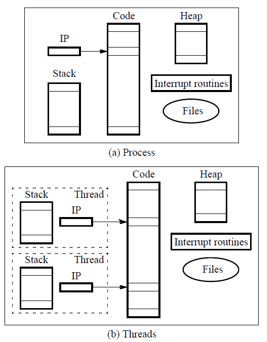
## 多线程服务器架构
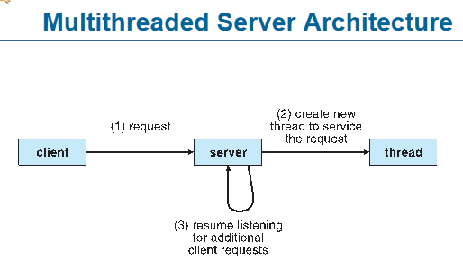
主要由客户端, 服务端和线程三部分组成
1. 客户端用来发送请求request
2. 服务器收到来自客户端的请求时, 创建一个新的线程来处理这个请求(create new thread to service the request); 
    完成这个操作后, 服务器会继续监听来自其他客户端的 额外请求(additional client requests);
    回复监听其他客户端的请求
3. 线程: 独立执行的任务单元, 用来处理来自客户端的请求

这种架构的关键是服务器为每个请求创建一个线程, 这样可以并行处理多个请求, 提高效率
### Benefits
1. Responsiveness: 如果进程的某部分被阻塞, 线程可能允许持续执行, 对于用户界面尤为重要
2. Resource Sharing: 线程共享进程的资源, 比共享内存或消息传递更为简单
3. Economy: 线程创建开销更低, 并且线程切换的开销低于上下文切换
4. Scalabilty: 可扩展性, 进程可以利用多处理器架构
## Question
1. 如何理解heavy-weight 和light-weight?
对于**重量级**, 指的是需要更多的资源(比如CPU时间, 内存)的操作或组件, 对于进程来说, 因为它们由独立的地址空间, 创建, 维护和上下文切换带来了相对较大的开销  
对于**轻量级**, 这些操作或组件相对简单, 消耗的资源较少;对于线程来说, 因为它们在同一进程内共享地址空间, 创建和管理的开销较小

2. 为什么多个任务可以由单独的线程实现, 这是怎么做到的?
线程是操作系统能够进行任务调度的最小单位; 每个线程都有自己的执行上下文, 但与**同一进程内**的其他线程共享内存和资源  

为什么可以由单独的线程实现多个任务?
    - 独立的执行上下文: 每个线程都有自己的寄存器集, 堆栈和程序计数器, 使得每个线程可以独立地运行并在需要时保存其状态
    - 共享内存: 线程之间共享同一进程的地址空间, 意味着一个线程可以访问另一个线程的数据, 使得线程之间的通信更为高效
    - 轻量级上下文切换: 与进程相比, 线程之间的上下文切换相对较快, 因为线程共享相同的地址空间. 这使得在多个线程之间切换成为一个搞笑的操作, 从而更容易并行地处理多个任务
    - 操作系统的支持: 现代操作系统为线程提供了支持，允许在单个进程中并行地运行多个线程。这些操作系统提供了线程管理、调度和同步机制，如互斥锁（mutexes）和条件变量(condition variables)

3. 指令指针是用来指向下一条需要执行的指令的地址的指针吗?
是的，指令指针（Instruction Pointer, IP），在某些文献中也被称为程序计数器（Program Counter, PC），是用来指向下一条需要执行的指令的地址的指针。当CPU执行指令时，指令指针会逐一地更新，使其指向接下来要执行的指令，确保CPU知道下一步应该从哪里获取指令。
# Multicore Programming
多核/多处理器系统, 需要克服众多挑战:
    1. Dividing activities 分解活动
    2. Balance 平衡
    3. Data splitting 数据分割
    4. Data dependency 数据依赖性
    5. Testing and debugging 测试和调试
## Concepts
- 并行性Parallelism: 意味着一个系统可以同时执行多个任务
- 并发性Concurrency: 支持多个任务的进行, 即使在单个处理器/核心上也能通过调度器实现并发
- 并行类型Types of parallelism:
    - 数据并行性Data parallelism: 在多个核心上分布相同的数据子集, 每个核心执行相同的操作
    - 任务并行性Task parallelism: 在核心之间分布线程, 每个线程执行独特的操作
- 随着线程数的增长, 对线程的体系结构支持也会增长:
    - CPU有cores和hardware threads硬件线程
    - 对于Oracle SPARC T4, 它有8个核心和每个核心有8个硬件线程

这部分主要强调在多核/多处理器环境中编程的复杂性

## 单线程进程vs多线程进程
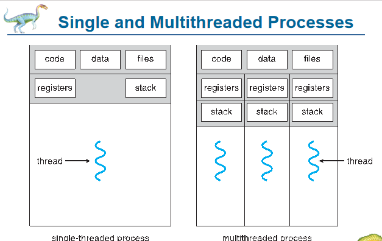
1. 对于单线程进程, 只有一个线程; 有一个寄存器组和一个堆栈来支持该线程
2. 对于多线程进程, 包括多个线程; 每个线程都有自己的寄存器组和堆栈, 但它们共享同一代码, 数据和文件区域

- 寄存器组和堆栈是每个线程执行和保存其状态所必须的
- 无论是单线程进程还是多线程进程, 它们都共享其内部的代码, 数据和文件区域
## Amdahl's Law
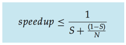
用于预测并行处理的潜在加速效果:
1. 性能增益: Amdahl定律标识了通过向应用程序添加额外的核心而获得的性能增益，这些应用程序具有串行和并行组件.
2. S表示串行部分:表示应用程序中不能并行化的部分; 即使在无限的处理器上, 这部分代码也将限制潜在的最大加速
3. N表示处理核心数: 用于并行执行的处理器或核心数量
4. 75%并行/25%串行的例子：如果一个应用程序的75%是可以并行的，而25%是串行的，那么从1个核心增加到2个核心可以得到**最多1.6倍**的加速。
5. 极限速度提升：当N趋向于无穷大时，速度提升趋近于1/S。这意味着应用程序中的串行部分将严重限制可以通过增加额外的核心获得的性能增益。
6. 现代多核系统的考量：Amdahl的法则是否考虑了当代多核系统的复杂性仍然是一个讨论的问题。

总之，Amdahl定律提供了一个理论框架，用于评估并行计算的潜在加速效果，特别是在考虑应用程序中的串行部分时。
## Questions
1. 如何理解并行性和并发性, 他们之间的区别?
    - 对于并行性, 它指的是两个或更多任务或进程在**同一时刻**进行
    - 对于并发性, 指的是两个或更多任务在**同一时间段**内启动, 运行和完成, 但在任何特定的时刻, 只有一个任务在执行;并发通常是由于任务之间的快速切换给出了这样的错觉
    - 区别:
        - 并行是真正的同时执行, 而并发可能是伪同时执行
        - 并行通常需要多核或多处理器的硬件支持, 而并发可以在单核处理器上实现
        - 并行性通常用于加速任务, 因为多个任务可以同时执行;并发性主要用于任务管理和资源利用最大化, 尤其是硬件资源有限的情况下


2. 堆栈和寄存器组的作用?
堆栈用于跟踪线程的函数调用和局部变量; 寄存器组用于存储线程的当前状态和变量.
- 每个进程都有自己独立的堆栈和寄存器, 这些是线程特有的, 不与其他线程共享; 一个线程不能访问或共享另一个线程的堆栈/寄存器
- 但是, 代码, 数据和文件这些区域是在进程级别共享的, 进程内的所有线程都可以访问这些共享资源

# Multithreading Models
## User Threads and Kernel Threads
线程的两种类型, 用户线程和内核线程
1. 用户线程User threads:
    - 由用户级线程库管理
    - 三个主要的线程库:
        - POSIX Pthreads
        - Win32 threads
        - Java threads
2. 内核线程Kernel threads:
    - 由操作系统内核支持和管理
    - 几乎所有的通用操作系统都支持内核线程, 例如:
        - Windows
        - Solaris
        - Linux
        - Tru64 UNIX
        - Mac OS X
用户线程是由用户级别的线程库进行管理的, 而内核线程则由操作系统内核支持.
## Many-to-One多对一多线程模型
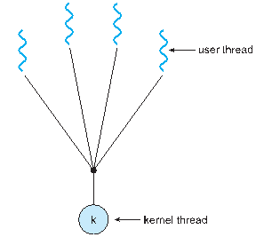
- 在这个模型中, 多个user thread映射到一个单独的kernel thread
- 如果其中一个线程被阻塞, 那么所有映射到**相同内核线程**的用户线程**也都会阻塞**
- 在多核系统上, 由于只有一个内核线程, 所以不可能同时运行多个线程(这里并不是说多核系统只有一个内核线程, 而是在多对一线程模型中, 多个user thread映射到一个单一的kernel thread); 也就是说, 在任何时候, 只有一个线程可以在内核中运行
- 很少有系统使用这个模型, 一些采用此模型的线程库包括：
    Solaris Green Threads（Solaris绿色线程）
    GNU Portable Threads（GNU可移植线程）
## One-to-One一对一线程模型
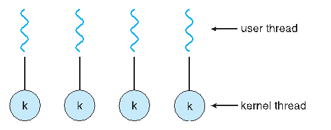
- 直接映射: 每一个user thread 都直接映射到一个kernel thread
- 线程创建: 当创建一个user thread时, 系统同时创建一个对应的kernel thread
- 并发性: 相比于多对一模型, 有更高的并发性, 因为多个thread可以同时在多核上运行
- 但由于资源和开销的限制, 一个进程内可创建的线程数可能会有限制
- 使用这种线程模型的操作系统包括Windows NT/XP/2000、Linux以及Solaris 9及更高版本。

- “一对一”模型允许每个用户线程拥有自己独立的内核线程，从而充分利用多核系统的并发性。但这可能会带来更大的资源开销，因此某些系统可能会限制每个进程的线程数量。
## Many-to-Many Model多对多模型

- 这种模型允许多个user thread映射到多个kernel thread, 更加灵活
- 操作系统可以根据需要创建足够数量的kernel thread, 以更好地管理并行任务
- Solaris（在版本9之前）和Windows NT/2000（使用ThreadFiber包）都采用了这种多对多的线程模型。
## Two-level Model
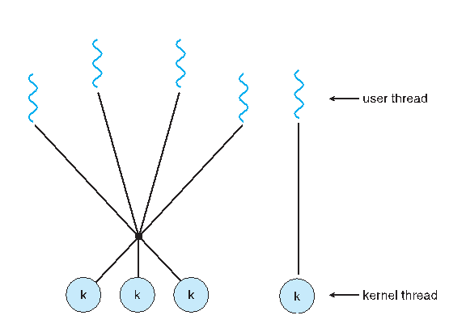
- 与M:M模型相似
- 允许user thread被绑定到一个特定的kernel thread, 也就是说, 某些user thread与特定的kernel thread有固定的关联
- 使用双层模型的操作系统包括IRIX、HP-UX、Tru64 UNIX以及Solaris 8及其更早的版本。
- 双层模型结合了多对多线程模型的特点，并加入了用户级线程与内核线程绑定的特性，为特定的应用场景提供了更大的灵活性。
## Questions
1. 多对一模型中, 怎么理解只有一个内核线程?
在“多对一”线程模型中，多个用户级线程映射到一个内核线程意味着，尽管你可能有多个核心，但由于这些用户线程都映射到一个内核线程，它们不能在不同的核心上同时运行。这限制了并行性和多核系统的利用率。
# Thread Libraries
- 线程库为开发者提供了创建和管理线程的工具，并可以根据是否依赖操作系统来选择不同的实现方式。
- 主要有两种实现方式:
    1. 用户空间实现: 线程库完全在用户空间中实现, 不需要操作系统的直接支持
    2. 内核级别实现: 线程库由操作系统直接支持
## Pthread
### Intro
Pthreads是一个按照POSIX标准制定的线程创建和同步API，它定义了规范，而不是实现，广泛应用于UNIX系列的操作系统。Pthreads可以是用户级别或内核级别提供。Pthreads在UNIX操作系统中很常见，如Solaris、Linux和Mac OS X。
### Execution
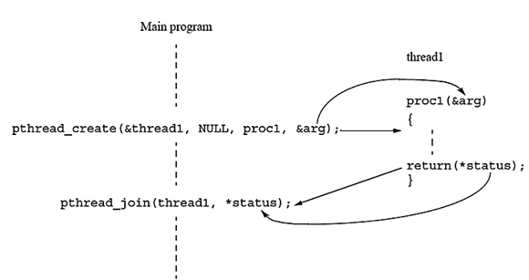
- pthread_create函数用于创建一个新的线程, 这个新线程被命名为"thread1"; 
    函数参数包括:
        - 线程标识符('&thread1')
        - NULL(通常用于线程属性, 此处未设置)
        - 'proc1'新线程将要执行的函数, 在执行完此函数后返回一个状态*status
        - 'arg'说传递给'proc1'函数的参数
- pthread_join(thread1, *status);
    此函数用于等待thread1线程完成. 目的是阻塞主程序, 直到指定的线程结束; 线程结束时, 它的返回值被保存在*status中
### Barrier
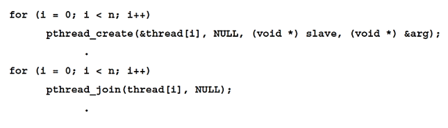
Pthreads中的pthread_join()函数用于等待指定的线程结束。为了在所有线程完成执行前创建一个屏障（即确保所有线程都已完成），可以多次使用pthread_join()函数。例如，在创建多个线程后，通过在循环中为每个线程调用pthread_join()，可以确保所有线程都完成执行后主程序再继续。
### Detached threads分离线程
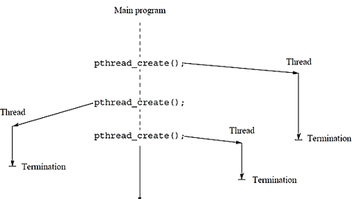
在Pthreads中，如果主线程不需要等待其创建的子线程结束，那么就不必使用pthread_join()来连接这些线程。这种不需要被主线程等待结束的线程被称为"分离线程"（detached threads）。
简而言之，分离线程允许它们自行完成并终止，无需主线程的干预或等待。
### Execution Order
在多处理器系统中，不同进程或线程的指令可能会交错执行。这意味着两个并发运行的进程之间的指令执行顺序不是固定的，可能会有多种可能的指令组合和执行顺序。
在给出的例子中，尽管每个进程内的指令按照其自身的顺序执行，但两个进程之间的指令可以以多种方式交织在一起。
### Thread-Safe Routines
如果它们可以被多个线程同时调用并始终产生正确的结果, 那么线程安全的System或library routines被称为"thread safe"  
例如，标准的I/O操作是线程安全的(可以在不交错字符的情况下打印消息) 然而，访问共享/静态数据的函数可能需要特殊的处理才能确保线程安全。例如，返回时间的系统函数可能不是线程安全的。为了确保任何函数的线程安全性，可以**强制只有一个线程一次执行该函数**。这可以通过将函数封装在临界区域内来实现，但这种方法效率很低。
### Accessing Shared Data
当两个进程同时访问和修改一个共享数据项x时，可能会出现数据不一致的问题.  
在这个例子中，每个进程都试图将x增加1。该操作包括三个步骤：读取x的值、计算x+1、将结果写回x。如果两个进程几乎同时执行这些操作，那么它们都可能读取相同的x值，进行计算，并写回相同的结果，从而导致x实际上只增加了1，而不是期望的2.  
这个情况突出了在并发环境中对共享数据的访问和修改所带来的挑战和问题.  
### Critical Section
- 临界区(Critical Section)是一种确保在同一时间只有一个进程访问特定资源的机制. 为了实现这一点，涉及到该资源的代码段被定义为“临界区”。
- 当某一进程首先进入某资源的临界区时，它会执行该临界区，同时阻止其他进程进入同一资源的临界区。当进程完成其临界区后，另一个进程被允许进入。这种确保资源在同一时间只被一个进程访问的方法称为“互斥”(Mutual Exclusion)

- 在Pthreads中，要保护关键部分（critical section）免受并发访问，可以使用**pthread_mutex_lock()**和**pthread_mutex_unlock()**函数：
    1. 使用pthread_mutex_lock(&mutex1);锁定mutex1, 进入critical section
    2. 执行critical section的代码
    3. 使用pthread_mutex_unlock(&mutex1);解锁互斥量, 退出critical section
- 其他
    - 如果一个线程尝试获取已被锁定的互斥量，它会等待该互斥量解锁。
    - 如果多个线程都在等待一个互斥量，当它解锁时，系统将选择一个线程继续执行。
    - **只有锁定互斥量的线程才能解锁它。**
### Locks
- 锁（Locks）是确保临界区（Critical Sections）互斥访问的最简单机制  
- 锁是一个1位的变量，当值为1时，表示有进程进入了临界区；当值为0时，表示没有进程在临界区内。
- 当一个进程来到临界区的“门”并发现它是开着的时，它可以进入临界区，并锁住“门”，以防止其他进程进入。一旦进程完成了它在临界区的工作，它就会解锁“门”并离开。 
### Spin Lock
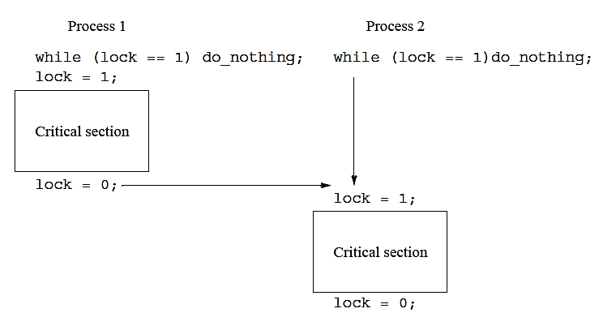
- 自旋锁（Spin Lock）是一种锁机制。当进程尝试获取锁并发现锁已被其他进程持有时，该进程会不断地检查锁状态，直到它可以获得锁。  
- 在此示例中：

    1. 当锁（lock）等于1时，进程会持续执行do_nothing操作，这意味着它在**等待锁被释放**
    2. 进程在进入临界区（Critical Section）前将锁设置为1。
    3. 进程在离开临界区后将锁设置为0，表明资源现在是空闲的。
- 在给定的图示中，Process 1和Process 2都试图获取锁来进入临界区。如果一个进程已经在临界区并持有锁，另一个进程会自旋等待，直到锁被释放。这就是自旋锁的工作原理，它让进程持续检查锁的状态，而不是使其休眠。
### Lock Rountines
在Pthreads中, 锁是通过互斥锁(mutually exclusive lock)变量, 也称为"互斥量"(mutex)实现的
1. 为了使用mutex, 首先需要声明一个类型为'pthread_mutex_t'的变量并初始化
```C
pthread_mutex_t mutex1;
pthread_mutex_init(&mutex1, NULL); //NULL指定了互斥量的默认属性
```
- 当不再需要mutex时, 可以使用**pthread_mutex_destroy()**函数来销毁它
### Conditional Variable
- 当需要在满足特定全局条件时执行临界区时，例如当变量达到特定值时，会面临一个问题。使用锁时，需要频繁地在临界区内检查（“轮询”）这个全局变量。这种做法非常耗时并且低效。这个问题可以通过引入所谓的“条件变量”(condition variables)来解决。 

- 条件变量提供了三种操作:
    1. wait(cond_car): 等待某个条件发生
    2. signal(cond_var): 表示该条件已经发生
    3. status(cond_var): 返回等待该条件发生的进程数
- 当执行wait操作时，它还会释放锁或信号量，从而允许另一个进程更改条件。当调用wait()的进程最终被允许继续执行时，锁或信号量将再次被设置。
- 例子
其中一个或多个进程（或线程）被设计为在计数器x为零时采取行动。另一个进程或线程负责递减该计数器。
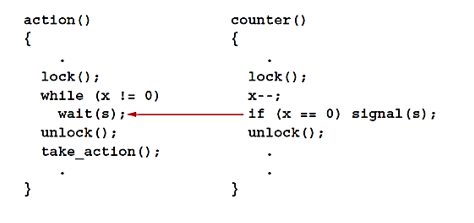

- action()函数：

    1. 上锁以确保同一时间只有一个线程可以执行。
    2. 如果x不等于0，则通过wait(s)进入等待状态。
    3. 解锁后，执行take_action()来进行某种行动。
- counter()函数：

    1. 上锁以确保同一时间只有一个线程可以执行。
    2. 递减x。
    3. 如果x为0，则通过signal(s)通知等待x变为0的进程或线程。
    4. 最后解锁。

- 通过这种方式，action()函数能够确保在x为0时才采取行动，而counter()函数会递减x并在适当的时候通知action()函数。
### Condition Variable Routines
- 如何在Pthreads中使用条件变量来控制多线程程序的同步

1. 首先需要对条件变量和互斥体声明和初始化, 以与特定的互斥量mutex相关联
    - 声明条件变量:pthread_cond_t cond1;
    - 声明互斥体：pthread_mutex_t mutex1;
    - 初始化条件变量：pthread_cond_init(&cond1, NULL);
    - 初始化互斥体：pthread_mutex_init(&mutex1, NULL);
2. 以下是两个函数action()和counter()描述了如何使用这些条件变量和互斥体：
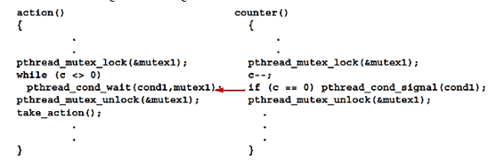
- 信号不会被记住。这意味着，为了接收到一个信号，线程必须已经在等待该信号
## Example
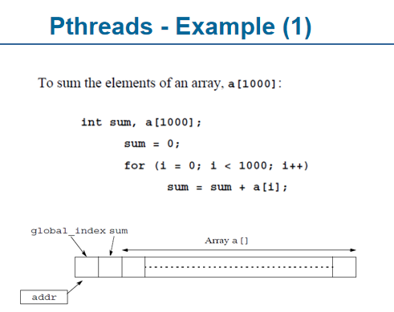
首先，定义了一个整数变量sum和一个大小为1000的整数数组a。
初始化sum为0。
使用for循环，遍历数组a的每个元素并将其累加到sum中。
图示展示了数组a[]的结构，以及全局索引sum与数组在内存中的位置关系
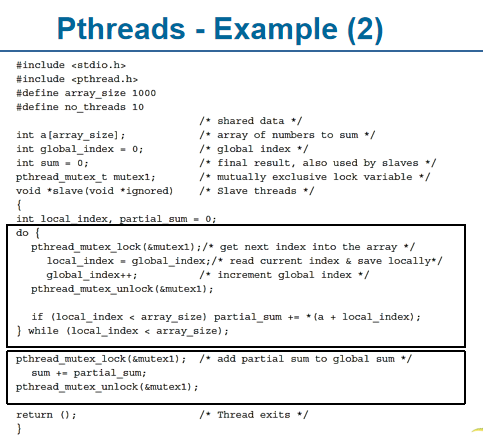
此示例展示了如何使用Pthreads库和互斥锁来并行地计算数组的所有元素之和。
1. 首先引入必要的头文件stdio.h和pthread.h
2. 定义了数组的大小为1000和线程数量为10
3. 声明了数组a[array_size]，用于存储要求和的数值
4. global_index是一个全局索引，用于跟踪哪个数组元素正在被处理
5. sum用于存储数组元素的总和
6. 使用pthread_mutex_t声明了一个互斥锁mutex1，确保在任何时候只有一个线程可以访问global_index
7. slave函数是线程执行的函数。每个线程执行以下操作：
    - 锁定mutex1来安全地读取和增加global_index。
    - 计算其部分和partial_sum。
    - 一旦线程处理完所有分配给它的数组元素，它会将其partial_sum加到全局sum上。
    - 最后，解锁mutex1并退出线程
通过这种方法，所有线程并行工作，加速了求和过程，同时确保数据的一致性和完整性。
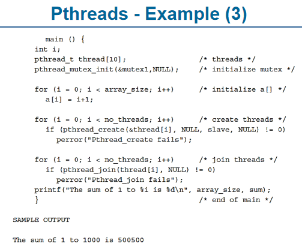
这是一个Pthreads示例，它并行地计算一个数组的所有元素的和.
1. 在main函数中，声明了一些基本的变量和数据结构：

    - i：用于循环。
    - pthread_t thread[10]：定义了10个线程的线程数组。
    - pthread_mutex_init(&mutex1,NULL)：初始化一个互斥锁。
2. 接下来，通过一个循环初始化数组a，使其每个元素的值为其索引值加1
3. 在下一个循环中，创建了no_threads个线程，并使用slave函数作为线程的入口点。如果线程创建失败，它会输出错误消息
4. 在另一个循环中，pthread_join函数确保所有线程都完成了它们的任务
5. 一旦所有线程都完成了它们的工作，主线程将输出数组元素的总和
## Questions
1. 关键区域解锁后, 系统选择下一个线程继续执行的选择标准是什么?

- 通常情况下，以下是一些可能影响线程选择的因素：

1. 先进先出（FIFO）：线程按照请求互斥量的顺序被排队。最先请求的线程最先获得互斥量。

2. 优先级：在某些系统中，优先级较高的线程可能会优先获得互斥量。这可以帮助避免优先级反转问题，但也可能引入其他并发问题。

3. 公平性和不公平性：公平的互斥量会尝试保证线程按照其请求顺序获得资源，而不公平的互斥量可能会更加高效，但可能不保证完全的公平性。

4. 等待时间：系统可能会考虑线程已经等待的时间，并给予长时间等待的线程优先权。

5. 特定的调度策略：操作系统可能采用特定的调度策略，这可能会影响到线程的选择。
# Implicit Threading隐式线程
与显示线程相比, 当线程增加的时候, 显式线程中确保程序的正确性变得更为困难
在隐式线程中，线程的创建和管理是由编译器和运行时库完成的，而不是由程序员直接控制。这种方法中主要探索了三种技术：
- 线程池 Thread Pools
- OpenMP
- Grand Central Dispatch
- 此外，还有一些其他的方法，如Microsoft的Threading Building Blocks (TBB) 和Java的 java.util.concurrent 包。
## Thread Pools
线程池是预先创建的线程集合, 这些线程等待任务分配, 主要优点如下:
1. 使用已存在的线程处理请求比新建线程更快
2. 可以通过限制线程池的大小来限制应用程序中的线程数量,从而控制资源使用
3. 将任务执行与任务创建分离使得可以采用不同策略来执行任务, 如定期执行任务
4. Windows API提供了对线程池的支持

## OpenMP
1. OpenMP支持C, C++和FORTRAN
2. OpenMP提供了在共享内存环境中并行编程的支持
3. 使用OpenMP, 程序员可以通过指令标记并行执行的代码块
4. #prafma omp parallel for会创建多个线程并行执行代码块, 其创建的线程数与核心数相同
5. #pragma omp parallel for可以使循环的每次迭代并行执行
6. 在给出的代码中, 除了被标记为#pragma omp parallel的部分并行执行外, 其余代码为顺序执行

## Grand Central Dispatch
- 它是Mac OS X和iOS操作系统的Apple技术。
- GCD为C和C++提供了扩展，包括API和运行时库。
- GCD允许开发者标识并行代码段，而无需管理线程的细节。
- 代码中的“块”（blocks）定义为使用^{...}的语法。
- 这些代码块被放入调度队列（dispatch queue）。
- 当从队列中移除时，这些块被分配到可用的线程上执行
- 有两种类型的调度队列:
    - 串行队列(serial): 按照FIFO的顺序一个接一个地执行块, 每个进程有一个主队列
    - 并发队列(concurrent): 允许多个块同时执行, 但仍然保持FIFO的顺序
- GCD提供了三个具有不同优先级的系统级调度队列：低、默认和高。
- 示例代码展示了如何从全局队列获取一个队列，并异步地在该队列上执行一个块。
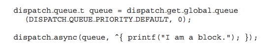
## Questions
1. 什么是OpenMP?
OpenMP (Open Multi-Processing) 是一个用于并行编程的应用程序接口 (API)，旨在帮助开发者为共享内存多处理器系统编写并行代码
2. 什么是Grand Central Dispatch?
Grand Central Dispatch (GCD) 是 Apple 开发的一种技术，用于优化应用程序以支持多核处理器并实现并发执行
3. 给出的示例代码中#pragma omp parallel是标记吗? 用来表示代码块并行执行吗?
#pragma omp parallel是一个OpenMP编译器指令, 用来标记后面的代码块为并行执行的区域。当这个指令被执行时，OpenMP会为该并行区域创建多个线程来并发执行该代码块。
# Threading Issues
多线程编程中存在的一些关键问题包括:
1. fork()和exec()这些系统调用在多线程环境中的行为可能与单线程环境中的行为不同
2. 信号可以是同步的(由执行当前操作的线程直接触发)或异步的(由外部事件或其他线程触发)
3. 当需要停止一个线程时, 可以选择异步取消(立即取消线程)或延迟取消(线程在到达某个检查点时停止)
4. 线程局部存储：是一种允许每个线程拥有其独特数据副本的机制。这意味着，即使多个线程执行相同的代码，每个线程都可以访问其私有数据。
5. 调度器激活: 关注线程如何由系统的调度器进行调度和管理。

## Semantics of fork() and exec()
1. fork()
- 主要的疑问是fork()是否仅复制(duplicate)调用它的线程，还是复制所有线程。具体的行为可能取决于具体的实现。
- 一些UNIX系统提供了两种版本的fork()，以处理这种差异。

2. exec()
- exec()通常按照预期工作，它替换正在运行的进程，包括其中的所有线程

简而言之，fork()在多线程环境中的行为可能因系统和实现而异，而exec()则常常替换整个进程和其内的所有线程。

## Signal Handling
1. 在UNIX系统中, 信号用于通知进程某个特定事件已发生
2. 使用信号处理程序Signal Handler来处理这些信号
3. 信号的生成和处理流程:
    由特定事件生成信号->将信号传递给进程->信号由两种信号处理程序之一处理:默认处理程序或用户定义的处理程序
4. 每个信号都有一个默认的处理程序, 该程序在内核处理信号时运行. 但用户可以定义自己的信号处理程序来覆盖默认处理程序
5. 对于单线程, 信号直接发送给进程
6. 对于多线程, 信号的传递方式有多种选择:
    - 将信号发送给与该信号相关的线程。
    - 将信号发送给进程中的每一个线程。
    - 将信号发送给进程中的特定线程。
    - 为进程指定一个特定线程来接收所有信号。

## Thread Cancellation(1)线程取消
1. 线程取消是在线程完成之前终止它的操作
2. 被取消的线程被称为目标线程
3. 有两种常见的取消方法:
    - 异步取消: 立即终止目标线程
    - 延迟取消: 允许目标线程定期检查是否应该被取消
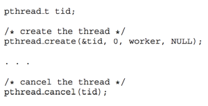
首先使用pthread_create创建线程, 然后使用pthread_cancel来取消线程
## Thread Cancellation(2)
1. 虽然可以请求取消线程，但实际的取消操作取决于线程的当前状态。
2. 有两种模式：延迟和异步。线程取消可以被禁用或启用。
3. 如果线程取消被禁用，取消请求会保持挂起状态，直到线程允许取消为止
4. 默认的取消类型是延迟。这意味着取消只会在线程到达某个取消点时发生。例如，当调用pthread_testcancel()函数时。
5. 一旦线程被取消, 将调用清理处理程序来进行清理
6. 在Linux系统中, 线程取消是通过信号来处理的

## Thread-Local Storage
线程局部存储（Thread-local storage, TLS）是一个允许每个线程拥有其自己数据副本的机制.
1. TLS允许每个线程拥有自己的数据副本
2. 当你不能控制线程创建过程时(比如在使用线程池时), TLS特别有用
3. TLS与局部变量不同. 局部变量只在单个函数调用期间可见, 而TLS在函数调用之间仍然可见
4. 虽然TLS与静态数据类似, 但每个线程都有其独特的TLS 

## Scheduler Activations调度器激活
1. M:M和两级模型都需要通信来维护为应用程序分配的内核线程的适当数量。
2. 通常在用户线程和内核线程之间使用一个中间的数据结构，称为轻量级进程（LWP）
    - LWP就像一个可以调度用户线程运行的虚拟处理器。
    - 每个LWP都关联一个内核线程。
    - 需要创建多少LWP是一个问题。
3. 调度器激活提供了一种从内核到线程库中的upcall处理器的通信机制，称为upcalls。
4. 通过这种通信，应用程序可以维护正确数量的内核线程。
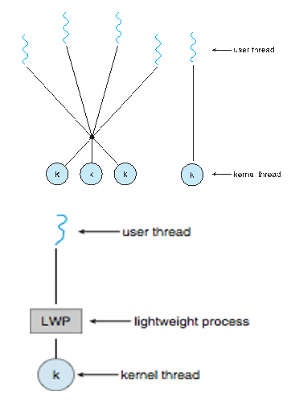
# Operating System Examples
这一部分内容看看就好了, 感觉也不会考
## Windows XP Threads
Windows线程有以下主要特点：
1. Windows通过Windows API实现线程管理，这是Windows 98、Windows NT、Windows 2000、Windows XP和Windows 7的主要API。
2. Windows使用一对一的映射方法在内核级实现线程。
3. 每个线程具有：
    - 线程ID
    - 表示处理器状态的寄存器集
    - 在用户模式或内核模式运行时的单独的用户和内核栈
    - 运行时库和动态链接库（DLLs）使用的私有数据存储区域
4. 寄存器集、栈和私有存储区域统称为线程的上下文。
5. 线程的主要数据结构包括：
    - ETHREAD（执行线程块）：包括指向所属进程的指针和指向KTHREAD的指针
    - KTHREAD（内核线程块）：包含调度和同步信息，内核模式栈和指向TEB的指针
    - TEB（线程环境块）：包括线程ID、用户模式栈和线程本地存储，在用户空间中。
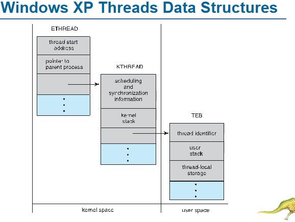
Windows XP线程的数据结构包括以下组件：
1. ETHREAD：位于内核空间中，包含线程的开始地址和指向其父进程的指针，以及其他关于线程的信息。

2. KTHREAD：同样位于内核空间，它包含线程的调度和同步信息以及内核栈。

3. TEB：位于用户空间中，包含线程标识符、用户栈和线程本地存储信息。

这些结构提供了线程在执行过程中所需的关键信息。ETHREAD和KTHREAD在内核空间中操作，主要用于系统级任务，而TEB在用户空间中操作，提供了用户级线程的关键数据和操作。
## Linux Thread

- 在Linux中，线程被称为"tasks"，而不是通常说的"threads"。线程的创建是通过系统调用clone()完成的。这个clone()函数使子任务（即子线程）能够共享父任务（即父线程或进程）的地址空间。此行为可以通过传递给clone()的标志来控制。
- 以下是一些主要的标志及其意义：
    1. CLONE_FS：文件系统信息被共享。
    2. CLONE_VM：相同的内存空间被共享。
    3. CLONE_SIGHAND：信号处理器被共享。
    4. CLONE_FILES：打开的文件集合被共享。
- 此外，struct task_struct是指向进程数据结构的指针，这些数据结构可以是共享的，也可以是唯一的，具体取决于线程的创建方式和其属性。